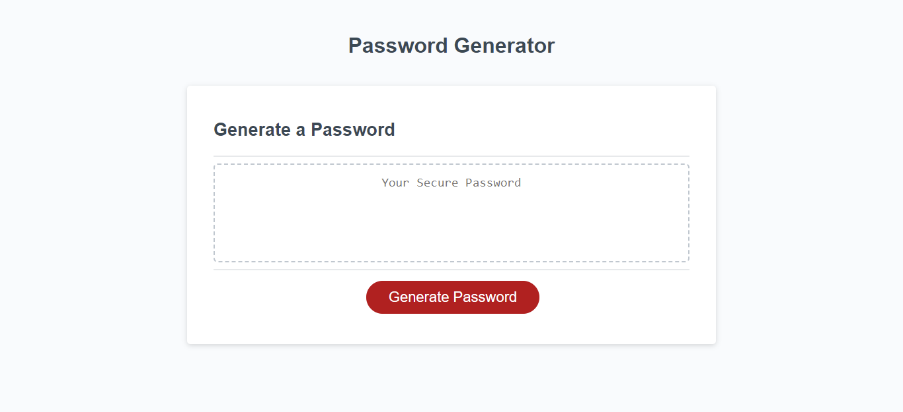

# password-generator

## Description

This website generates a password based on the choices of the user. 
* After clicking the button, users will be prompted to make a number of choices with regards to their password
* Users can choose to generate a password between 10 and 64 characters
* Users can choose the type of characters to include between capital letters, lower case letters, special and numeric characters
* The generator will return a password inline with their choices

## Screenshot

## Link to deployed website

https://github.com/ffionerin/password-generator

